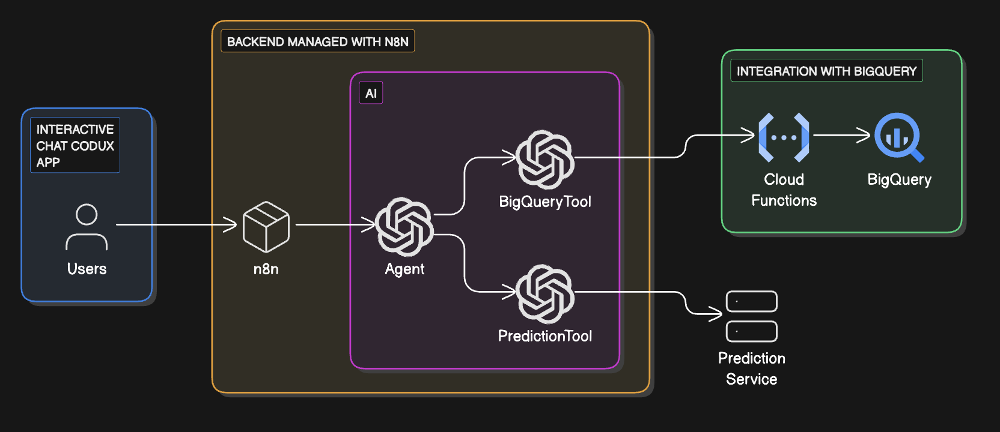
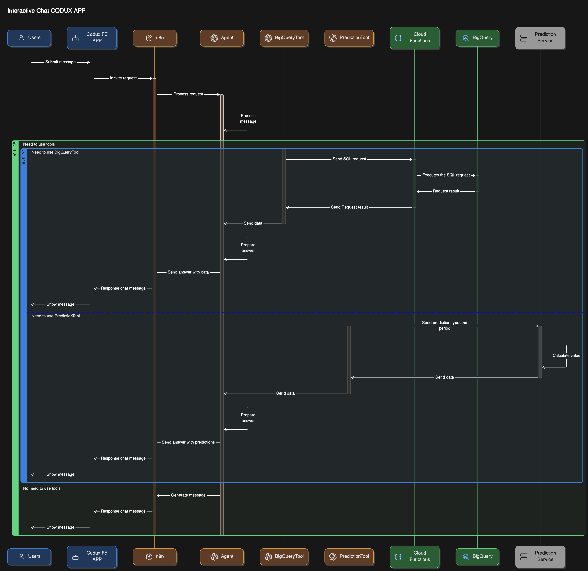
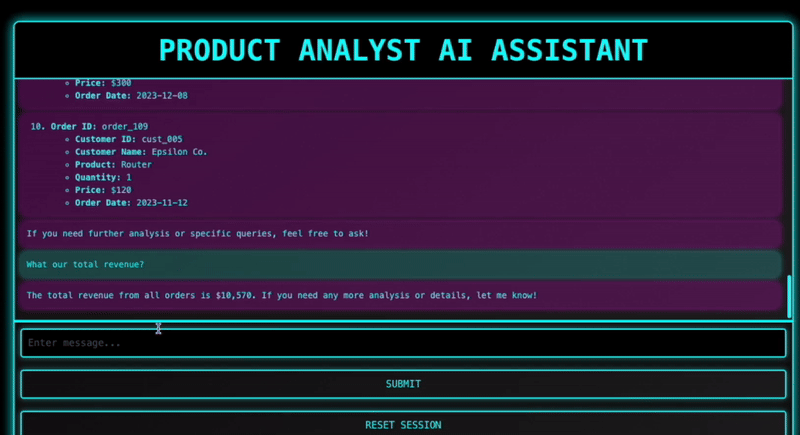

# Product Analyst AI Assistant PoC Project

## Overview
The project features an AI assistant designed to help users analyze data and forecast key business metrics. The assistant integrates with various tools to retrieve, process, and analyze data, providing users with a seamless and intuitive interaction interface.

## Key Features
| Feature | Description |
| ----- | ----- |
| Interactive Chat with the Agent | <p>Users can send requests through an intuitive chat interface.</p><p>The agent processes queries and responds using the capabilities of the OpenAI API.</p><p>The agent is configured to handle requests related to data analysis, forecasting, and BI reporting.</p> |
| Integration with BigQuery via Cloud Functions | <p>A tool interacts with Google BigQuery to build SQL queries.</p><p>Query results are used to generate reports, analyze data, or provide visualizations.</p><p>The process is automated using Google Cloud Functions, ensuring high performance and flexibility.</p> |
| Custom Sales Forecasting Service | <p>A tool communicates with a custom service to analyze historical data and provide sales forecasts.</p><p>Forecasts include overall order volume predictions as well as detailed insights by product categories.</p><p>The service is trained on specific business data and integrated with the agent via n8n.</p> |
| Backend Managed with n8n | <p>The entire request-handling logic is configured using n8n, a powerful workflow automation tool.</p><p>n8n connects OpenAI API, Google Cloud Functions, and the custom forecasting service, serving as a unified control point for interactions.</p><p>Ensures scalability and ease of adding new integrations.</p> |
| Machine Learning with OpenAI API | <p>The assistant is trained to understand complex business queries and respond with contextually accurate and analytical answers.</p><p>OpenAI powers the assistant’s ability to provide insightful and relevant responses.</p> |
## Use Cases
- Building SQL queries for analyzing sales.
- Generating sales forecasts for future periods.
- Retrieving detailed data by products,  sales, and other metrics.
## Architecture overview



| **Aspect** | Tool | PL |
| ----- | ----- | ----- |
| Frontend | Codux | Typescript |
| Backend | n8n | JS (in custom code nodes)  |
| GCP | Cloud functions | Typescript |
| Database | BigQuery | SQL |
| Prediction service | Custom code | Typescript |
## Demo


### Integration with BigQuery

To integrate with BigQuery, a specialized BigQuery tool is utilized. Based on the context, the tool determines the need to construct a query within the dataset. The query is then generated and sent to a cloud function, where it undergoes validation and execution. Once the data is retrieved, the agent processes it into a user-friendly format and, if required, provides actionable insights or conclusions.

Output example

```
`SELECT * FROM datasetename.orders`
```
### Integration with Prediction Service

The **Prediction Tool** is designed to handle requests for future sales forecasts. This tool interacts with a dedicated prediction service to retrieve expected parameters and insights for specified time periods.

Output example

```
{ "prediction_type": "month", "quantity": 2 }
```


